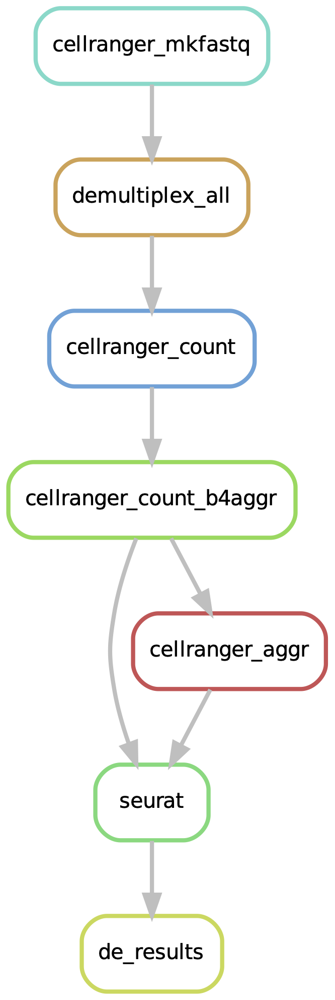
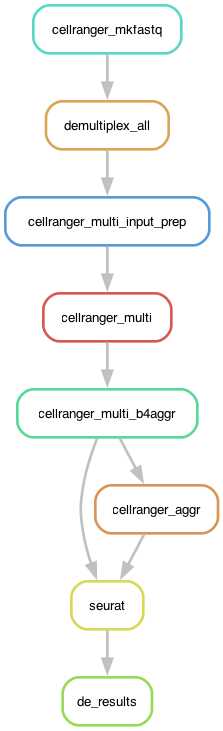

# Introduction:
```{r echo =FALSE, eval = FALSE}
packageVersion("knitr")
packageVersion("rmarkdown")
```

```{css echo = FALSE}
img {vertical-align: top;}
```

```{r fig.show = "hold", fig.cap = "pipeline", fig.subcap=c("count","multi"), out.width = "50%", out.height="50%", fig.align = "default", echo = FALSE}


```


The single-cell RNA pipeline can start from either bcl files with initial demultiplexing or already demultiplexed fastq files.

Based on the data format at the start

**BCL files**

Please prepare a csv file in one of the following formats:

**[a]** pipeline **count**: gene expression-only data 
```txt
feature_type,run_bcl_path,iem_samplesheet,samplesheet_4_bcl,fastq_outdirectory,bcl_run_index
"Gene Expression",/path/bcl/folder1,False,/path/to/samplesheet/for/bcl/folder1,/path/to/fastq/output/dir1,run1
"Gene Expression",/path/bcl/folder2,True,/path/to/samplesheet/for/bcl/folder2,/path/to/fastq/output/dir2,run2
```

**[b]** pipeline **multi**: gene expression and VD(J) data
```txt
feature_type,run_bcl_path,iem_samplesheet,samplesheet_4_bcl,fastq_outdirectory,bcl_run_index
"Gene Expression,/path/bcl/folder1,False,/path/to/samplesheet/for/bcl/folder1,/path/to/fastq/output/dir1,run1
"VDJ-B",/path/bcl/folder2,False,/path/to/samplesheet/for/bcl/folder2,/path/to/fastq/output/vdj_bcell,runbcell
"VDJ-T",/path/bcl/folder3,False,/path/to/samplesheet/for/bcl/folder3,/path/to/fastq/output/vdj_tcell,runtcell
```

The bcl samplesheet (/path/to/samplesheet/for/bcl/folder1) can either be a simple samplesheet (iem_samplesheet **False**)

```txt
Lane,Sample,Index
1,test_sample_atac,SI-NA-A1
```
or 

an Illumina Experiment Manager file (iem_samplesheet **True**)
```txt
[Header],,,,,,,,
IEMFileVersion,4,,,,,,,
Investigator Name,rjr,,,,,,,
Experiment Name,hiseq_test,,,,,,,
Date,8/15/16,,,,,,,
Workflow,GenerateFASTQ,,,,,,,
Application,HiSeq FASTQ Only,,,,,,,
Assay,TruSeq HT,,,,,,,
Description,hiseq sample sheet,,,,,,,
Chemistry,Default,,,,,,,
,,,,,,,,
[Reads],,,,,,,,
26,,,,,,,,
98,,,,,,,,
,,,,,,,,
[Settings],,,,,,,,
,,,,,,,,
[Data],,,,,,,,
Lane,Sample_ID,Sample_Name,Sample_Plate,Sample_Well,I7_Index_ID,index,Sample_Project,Description
1,s1,test_sample,,,SI-P03-C9,SI-P03-C9,p1,
```

```{r, results='asis', echo = FALSE}
cat("<pre>🚨 <span style='color: red;'>Important</span>!\n\nDo not trim adapters during demultiplexing. Leave these settings blank.
Trimming adapters from reads can potentially damage the 10x barcodes and the UMIs, resulting in pipeline failure or data loss.
If you are using an Illumina sample sheet for demultiplexing with bcl2fastq, BCL Convert or our mkfastq pipeline,
please remove these lines under the [Settings] section: Adapter or AdapterRead1 or AdapterRead2.</pre>")
```

**FASTQ files**

Please prepare csv file with the following format:

```txt
fastq,sample,library_type
/path/to/sampl1_fastq_directory/,sample1,Gene Expression
/path/to/sampl2_fastq_directory/,sample2,Gene Expression
/path/to/sampl3_fastq_directory/,sample3,Gene Expression
/path/to/sampl4_fastq_directory/,sample4,Gene Expression
```
