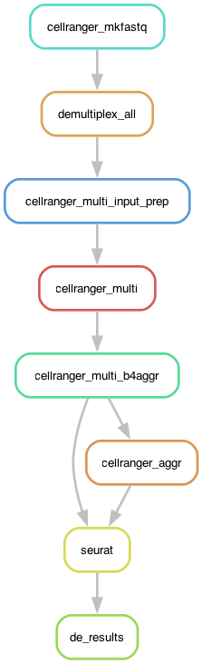

## snakemake pipeline for 10X data analysis using cellranger and seurat!  


Following demultiplexing and count generation and aggregation using cellranger, the Seurat wrapper [scQCAD](https://github.com/BioDebojyoti/scQCAD)
 performs the following:

Quality control,  
Batch correction (optional),  
Clustering  
Cell-type annotation using SingleR  
Differential expression (DE) analysis (optional).


# Introduction:

The following should be present in your system
```bash
singularity-3.8.6
snakemake-7.12.1 (also worked with snakemake-8.27.1)
conda 23.3.1
```

To run the pipeline, use:
```bash
snakemake -s Snakefile_count_full.smk --profile profile --use-conda --use-singularity
```
or if you want to analyze the GEX + V(D)J data
```bash
snakemake -s Snakefile_multi_full.smk --profile profile --use-conda --use-singularity
```

All configuration files neeeded are described below and should be configured as required!  


A successful run should generate a folder with the following tree

```bash
$ tree -L 1 -d
.
├── aggr_results
├── fastq_directory
├── multi_results (or count_results)
├── report.html
└── seurat_out
```
 and a report.html as below:
 
<p align="center">
  
</p>


The single-cell RNA pipeline starts from **bcl files** (requiring initial demultiplexing).

<p align="center">
  
&nbsp; &nbsp; &nbsp; &nbsp;
  
</p>

Based on the data format at the start

**BCL files**

Please prepare a csv file in one of the following formats:

**[a]** pipeline **count**: gene expression-only data 

```txt
feature_type,run_bcl_path,iem_samplesheet,samplesheet_4_bcl,bcl_run_index
"Gene Expression",/path/bcl/folder1,False,/path/to/samplesheet/for/bcl/folder1,run1
"Gene Expression",/path/bcl/folder2,True,/path/to/samplesheet/for/bcl/folder2,run2
```

**[b]** pipeline **multi**: gene expression and VD(J) data
```txt
feature_type,run_bcl_path,iem_samplesheet,samplesheet_4_bcl,bcl_run_index
"Gene Expression,/path/bcl/folder1,False,/path/to/samplesheet/for/bcl/folder1,run1
"VDJ-B",/path/bcl/folder2,False,/path/to/samplesheet/for/bcl/folder2,runbcell
"VDJ-T",/path/bcl/folder3,False,/path/to/samplesheet/for/bcl/folder3,runtcell
```

The bcl samplesheet (/path/to/samplesheet/for/bcl/folder1) can either be a simple samplesheet (iem_samplesheet **False**)

```txt
Lane,Sample,Index
1,test_sample_atac,SI-NA-A1
```
or 

an Illumina Experiment Manager file (iem_samplesheet **True**)
```txt
[Header],,,,,,,,
IEMFileVersion,4,,,,,,,
Investigator Name,rjr,,,,,,,
Experiment Name,hiseq_test,,,,,,,
Date,8/15/16,,,,,,,
Workflow,GenerateFASTQ,,,,,,,
Application,HiSeq FASTQ Only,,,,,,,
Assay,TruSeq HT,,,,,,,
Description,hiseq sample sheet,,,,,,,
Chemistry,Default,,,,,,,
,,,,,,,,
[Reads],,,,,,,,
26,,,,,,,,
98,,,,,,,,
,,,,,,,,
[Settings],,,,,,,,
,,,,,,,,
[Data],,,,,,,,
Lane,Sample_ID,Sample_Name,Sample_Plate,Sample_Well,I7_Index_ID,index,Sample_Project,Description
1,s1,test_sample,,,SI-P03-C9,SI-P03-C9,p1,
```


<pre>🚨 <span style='color: red;'>Important</span>! Do not trim adapters during demultiplexing. Leave these settings blank.
Trimming adapters from reads can potentially damage the 10x barcodes and the UMIs, resulting in pipeline failure or data loss.
If you are using an Illumina sample sheet for demultiplexing with bcl2fastq, BCL Convert or our mkfastq pipeline,
please remove these lines under the [Settings] section: Adapter or AdapterRead1 or AdapterRead2.</pre>

Setup the profile yaml file profile/config.yaml 

```yaml
snakefile: Snakefile
cores: 32
latency-wait:
reason: True
show-failed-logs: True
keep-going: True
printshellcmds: True
rerun-incomplete: True
restart-times:

# singularity
use-singularity: True
singularity-args: "--bind /home/debojyoti/Projects/"
```

```bash
$tree
.
├── LICENSE
├── README.md
├── rulegraph_count.png
├── rulegraph_multi.png
└── workflow
    ├── config
    ├── profile
    ├── README
    ├── README_SEURAT.html
    ├── README_SEURAT.md
    ├── rules
    ├── scripts
    ├── Snakefile
    ├── Snakefile_count_full.smk
    └── Snakefile_multi_full.smk
```


config file:
1. workflow/config/config_mkfastq.yaml

```yaml
bcl_folder_paths: "./bcl_folder_paths.csv"

resources:
  localcores: 8
  localmem: 32
  max_cores: 48
  max_memory: 128

additional_arguments:
```
2. workflow/config/config_count.yaml

```yaml
# A unique run id and output folder name [a-zA-Z0-9_-]+
output_count: "/home/debojyoti/Projects/count_results"

# if additional information is needed to add
add_info_aggr: "/home/debojyoti/Projects/additional_info.csv"

# Only used if start_with_bcl is False
paths2fastq_file: 
transcriptome: "/home/debojyoti/Projects/refdata_gex_GRCh38_2020_A"

resources:
  localcores: 8 # Set the number of cores to use (e.g., 16)
  localmem: 32 # Set the amount of memory to use in GB

feature_ref: # "/path/to/feature_ref.csv"  # Path to the Feature Reference CSV file (optional)
libraries_csv: # "/path/to/libraries.csv"  # Path to the Libraries CSV file (optional)

additional_arguments: "--create-bam=false" # required

# additional but optional arguments are
# "--jobmode local" # Job manager to use. Valid options: local (default), sge, lsf, slurm or path to a .template file.
#         or
# "--chemistry "fiveprime" or something else
# Assay configuration. NOTE: by default the assay configuration is detected automatically, which is the recommended mode. You usually will not need to specify a chemistry. Options are: 'auto' for autodetection,
# 'threeprime' for Single Cell 3', 'fiveprime' for  Single Cell 5', 'SC3Pv1' or 'SC3Pv2' or 'SC3Pv3' or 'SC3Pv4' for Single Cell 3' v1/v2/v3/v4, 'SC3Pv3LT' for Single Cell 3' v3 LT, 'SC3Pv3HT' for Single Cell 3'
# v3 HT, 'SC5P-PE' or 'SC5P-PE-v3' or 'SC5P-R2' or 'SC5P-R2-v3', for Single Cell 5', paired-end/R2-only, 'SC-FB' for Single Cell Antibody-only 3' v2 or 5'. To analyze the GEX portion of multiome data, chemistry
# must be set to 'ARC-v1' [default: auto]
#         or
# "--expect-cells 3000"  # This is where you specify the expected cell count
# "--force-cells 2000"   # Optional: This can also be specified
#         or
# "--lanes 12"           # Only use FASTQs from selected lanes
#         or
# "--project <TEXT>"
# Name of the project folder within a mkfastq or bcl2fastq-generated folder
# # from which to pick FASTQs
#         or
# "--nosecondary                  # Disable secondary analysis, e.g. clustering. Optional
# "--r1-length <NUM>              # Hard trim the input Read 1 to this length before analysis
# "--r2-length <NUM>              # Hard trim the input Read 2 to this length before analysis
# "--include-introns <true|false> # Include intronic reads in count [default: true] [possible values: true, false]
# "--no-libraries                 # Proceed with processing using a --feature-ref but no Feature Barcode libraries specified with the 'libraries' flag
# "--check-library-compatibility <true|false> # Whether to check for barcode compatibility between libraries. [default: true] [possible values: true, false]
# "--min-crispr-umi <NUM>"         # Minimum CRISPR UMI threshold [default: 3]

```


3. workflow/config/config_multi.yaml
 <!-- multi_config_csv:
 [
    "/home/debojyoti/Projects/core_facility/multi_results/S14_multi_samplesheet.csv",
    "/home/debojyoti/Projects/core_facility/multi_results/S22_multi_samplesheet.csv",
    "/home/debojyoti/Projects/core_facility/multi_results/S29_multi_samplesheet.csv",
    "/home/debojyoti/Projects/core_facility/multi_results/S31_multi_samplesheet.csv",
  ]-->
```yaml
#output_multi: "/home/debojyoti/Projects/beam_t/runs"
output_multi: "/home/debojyoti/Projects/multi_results"

multi_config_csv:
additional_info_aggr: "/home/debojyoti/Projects/additional_info.csv"
input_csvs:

gene_expression:
  reference: "/home/debojyoti/Projects/core_facility/cellranger_snakemake/refdata_gex_GRCh38_2020_A"
  create_bam: False
  probe_set:
  filter_probes:
  r1_length:
  r2_length:
  chemistry:
  expect_cells:
  force_cells:
  no_secondary:
  check_compatibility:
  include_introns:
vdj:
  reference: "/home/debojyoti/Projects/core_facility/cellranger_snakemake/refdata_cellranger_vdj_GRCh38_alts_ensembl_710"
  primers:
  r1_length:
  r2_length:
resources:
  localcores: 8 # Set the number of cores to use (e.g., 16)
  localmem: 64 # Set the amount of memory to use in GB

# use_feature_ref: False # Indicates whether to use the --feature-ref parameter
# use_libraries: False # Indicates whether to use the --libraries parameter

# feature_ref: "feature_ref.csv" # # Path to the Feature Reference CSV file (optional)
# libraries_csv: "libraries.csv" # Path to the Libraries CSV file (optional)
```


4. workflow/config/config_aggregate.yaml
```yaml
resources:
  localcores: 8 # Set the number of cores to use (e.g., 16)
  localmem: 64 # Set the amount of memory to use in GB

aggr_input_file: #
aggregation_id: "aggr_gex_vdj_4_samples" # Required. A unique run ID string: e.g. AGG123
normalize: "mapped"

aggr_outdir: "/home/debojyoti/Projects/multi_results/aggr_results_health_status"
```

5. workflow/config/config_seurat.yaml
```yaml
count_file: "/home/debojyoti/Projects/core_facility/multi_results/outs/count/filtered_feature_bc_matrix.h5"
aggr_csv_file: "/home/debojyoti/Projects/core_facility/multi_results/outs/aggregation.csv"

resources:
  cores: 4
  threads: 16
  memory: 16

out_directory:
# seurat output directory

min_cells:
# minimum cells [default= 3]

min_features:
# minimum features [default= 100]

max_features:
# maximum features [default: 3000]

percent_mt:
# threshold percent mitochondrial [default: NULL]
# default filtering is done using 95th quantile

percent_rb:
# threshold percent ribosomal [default: NULL]
# default filtering is done using 95th quantile

project:
# output file name [default: singleCell]

vdj_t:
# V(D)J_T annotations [default: NULL]

vdj_b:
# V(D)J_B annotations [default: NULL]

layer_column: "donor"
# describes experimental batches, donors, or conditions [default: NULL]

condition_column:
# main condition for comparision  [default: NULL](can be same as batch variable)

integration_method:
# integration method  [default: NULL](CCAIntegration, RPCAIntegration, HarmonyIntegration, FastMNNIntegration, scVIIntegration)

enable_SCTransform:
# sctransform normalization [default: TRUE]

perform_DE:
# differential expression analysis [default: FALSE]

species:
# annotation for species [default: human]
```


